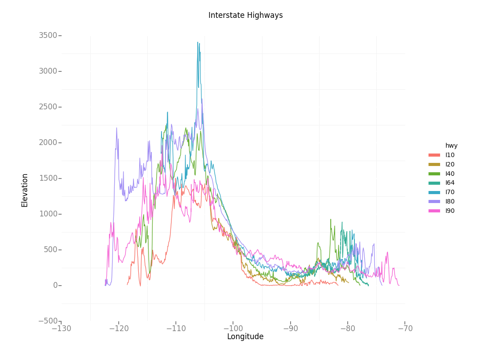

# Highway elevations

### Plotting the elevations of interstate highways across the USA

I recently moved from Austin, TX to Boston, MA. It was a four-day drive!

At one point, as the highway crested over a mountain pass in the Appalachians, I was struck by the text on a highway sign.

Seeing this sign, I felt momentarily awed, by the long scales of these highways, and the perspectives that are needed to sense those scales.

Thinking on it further, it reminded me of the album cover of *Unknown Pleasures*, by Joy Division.

It's an incredibly famous album cover, with [fascinating origins](https://blogs.scientificamerican.com/sa-visual/pop-culture-pulsar-origin-story-of-joy-division-s-unknown-pleasures-album-cover-video/).

I thought: wouldn't it be cool to plot the elevations of interstate highways, and then stack them on top of each other, à la *Unknown Pleasures*? Such an image would present a cross-sectional slice of the whole of America, as experienced by drivers on interstate highways, but on a scale greater than what we might usually sense.

Another source of inspiration is John McPhee's classic book [*Annals of the Former World*](https://en.wikipedia.org/wiki/Annals_of_the_Former_World). The book uses geological features along the length of I-80 to explore the history of geological science, the pains and pleasures of academia, and how the immensity of geological time scales dwarf the human lifespans that we're used to considering in each day. It's one of my favorite books. His choice of I-80 is somewhat arbitrary, and so this project could also be a simple glimpse into what other highways might present geologically.

And so this project was born!

## Workflow

* Find the routes of cross-country interstate highways in the USA
    * The Google Maps API can find Directions, and I can use that (plus waypoint adjustments) to get the routes of highways
    * Alternatively, find KML files that precisely trace highway routes
* Encode these routes in a compressed format
    * Google's [Polyline algorithm](https://developers.google.com/maps/documentation/utilities/polylinealgorithm) is perfect for this!
* Use the Google Maps Elevations API to find the elevations along these highway routes
* Plot those elevations!
* Repeat for all major interstate highways!

## Current progress

* Added most of the major interstate highways! The plot for them is below.
* `ElevationHighways.py`
    * Gets route KML from Wikipedia
    * Uses KML to get Google Maps directions, and the included polyline
    * Uses polyline to get elevations along route, saved as CSVs
    * Plot for individual highways created
* `Plotter.py`
    * CSVs combined into a master dataframe
    * Master plot created and saved

## Todo

* Not sure how robust the `ElevationHighways.py` script really is, will test further
* Plot is somewhat hard to read, since lines are all on top of each other
    * Should incorporate latitude (or average latitude) somehow
        * Could be a 3-D plot
        * Or just offset, like in the *Unknown Pleasures* art, with y-axis removed
    * An interactive plot would be cool, to see the exact elevation and location of different points
    * Maybe overlay on top of a US map somehow? That'd be cool!
* My Google Maps API key is currently made public, which is certainly not good practice, I'll need to import that separately somehow

## Footnotes

* Roger Shaw
* Currently a fellow at Insight Health Data Science, transitioning from academia into a career in data science
* This is just a side project, for playing around with Google Maps APIs, geographic data, nested JSONs, plotting, etc.
